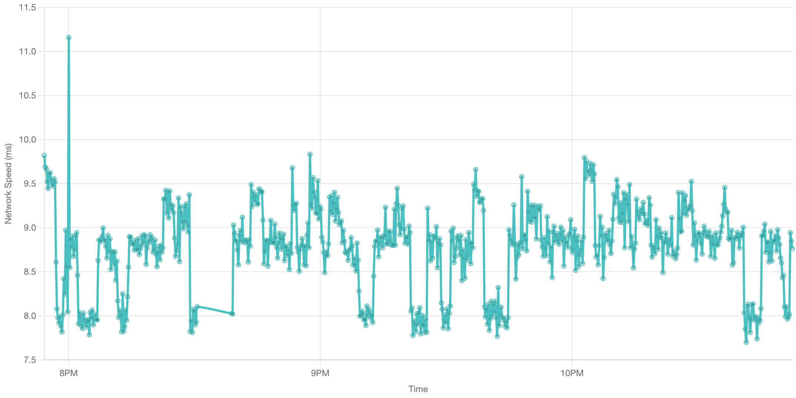
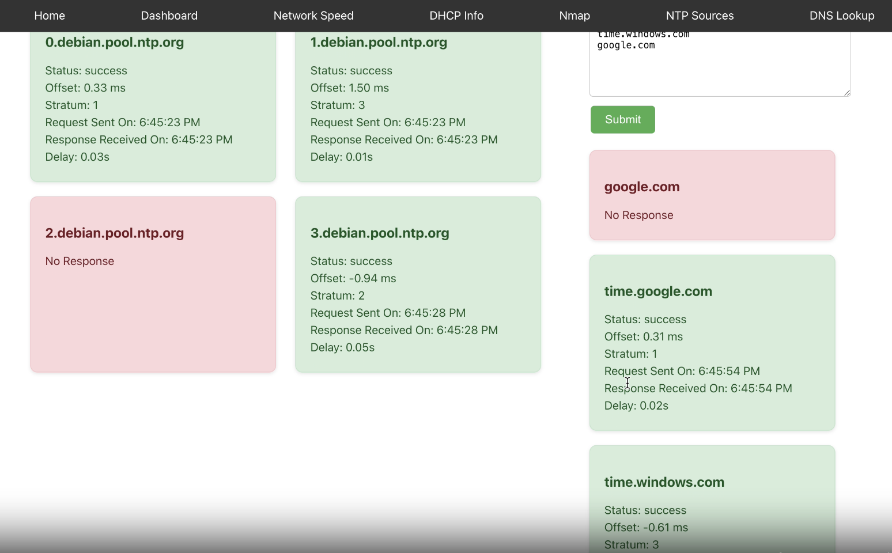

<h2 align="center">WiMonitor</h2>
<p align="center">
    A network monitoring project.

# Authors
* **[Yunhao Jiang](https://github.com/yunhao-jiang)** 
* **[Georgia Li](https://github.com/nori210)**  

# Usage
* Users should set the tested endpoint at the home page before they go to other tabs.
* Network Ping Test
  * We take average rtt as our data.
  * Users can directly save the image to local.
  
  * "Clear All Data" button will clear up the database.

* DHCP lease and DHCP pool scan
  * We use nmap to scan the ip.
  * Users can set threshold of dhcp usage in `backend/config.py`.
* NTP Source
  * We test connection to NTP servers.
  
* DNS lookup
  * Users can input hostname or ip address.

# Get Started
To install all the dependency in the backend, run
  ```sh
 cd backend
  ```
then
  ```sh
 pip install -r requirements.txt
  ```
To install all the dependency in the frontend, run
  ```sh
 cd frontend
  ```
then
  ```sh
 npm install
  ```

To start database, run
  ```sh
  docker run --name mongodb -p 27017:27017 -d mongo
  ```
# Customize Setting

Change your system setting in `backend/config.py`


_The path of DHCP Lease may vary from systems to system._


# Future Features

_We left several potential features to be implemented._

For exisiting features:
* Build changelog for exisiting functionalities, such as NTP analysis.
* Build visualization for exisiting functionalities, such as NTP analysis.

For features we have planned but didn't develop:
*  Deep packet inspection (Intrusion Protection System)
*  MTU path discovery